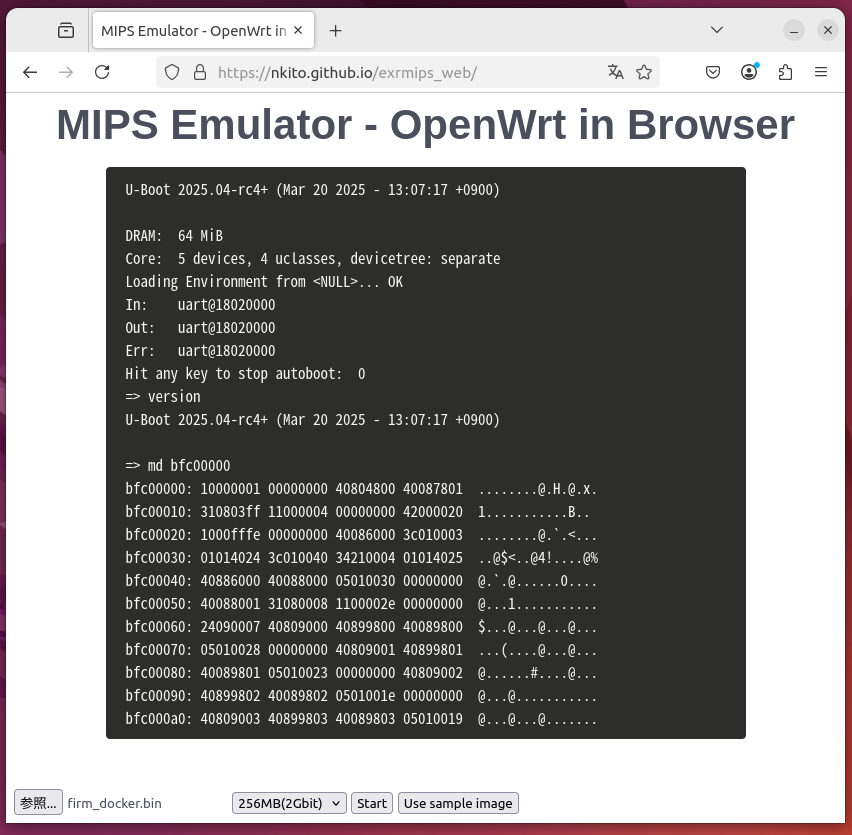
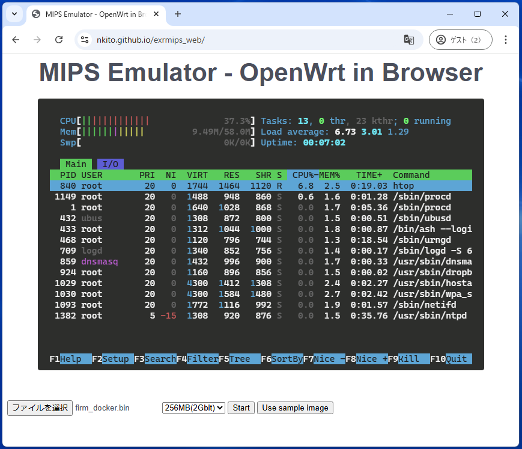

# MIPS Emulator (Rust version)

## Overview

This is a Rust version of MIPS32R2 emulator [exmips](https://github.com/nkito/exmips "exmips").
This emulator works as a console application and also works in a Web browser as WebAssembly codes.
OpenWrt, a well-known Linux distribution for home routers, works in the emulator of both console application version and Web browser version.

[This page](https://nkito.github.io/exrmips_web/ "OpenWrt in a browser") demonstrates the emulator in Web browser.
Pressing the "Use sample image" button invokes the emulator.

 

## Build

### Console application
A console appliation is obtained as follows.
```
$ cargo build --release
```
Note that a program binary obtained with "debug" build may not work properly. It is a known bug.
The emulator uses additions with overflow intentionally. However, such overflow causes "panic" when a debug-build version is used.

### WebAssembly package
A WebAssembly package of the emulator to use it in Web browsers is obtained as follows.
```
$ wasm-pack build --target web
```
``wasm-pack`` is necessary to compile it. It can be installed by ``cargo install wasm-pack``. 

### Flash memory image (consisting of U-Boot and OpenWrt)

A flash-memory image file is necessary to use the emulator. The generation of a necessary ROM image is described in [exmips](https://github.com/nkito/exmips "exmips").
Some prebuild flash-memory image files are in [this repository](https://github.com/nkito/exmips_images "Image files for MIPS32R2 emulator").
If customization is unnecessary, using a prebuilt image is an easy way.

## Usage

The emulator works using a flash-memory image. 

The following command invokes the console application.
```
$ cargo run --release flash_memory_image_file.bin
```
The emulator halts with "reset" command in U-Boot or "reboot" command in Linux terminal.
Twice inputs of Ctrl+C also halt the emulator.

The emulator simulates 64Mbit (8MBytes) Spansion S25Fl164K SPI flash memory by default. 
It also support 2Gbit (256MBytes) Macronix MX66U2G45G SPI flash memory and the 2Gbit flash is selected when "-f 256" option is used. 
The emulator loads the flash-memory image before starting the emulation. 
The image file will not be modified even if the flash is modified in emulator.

